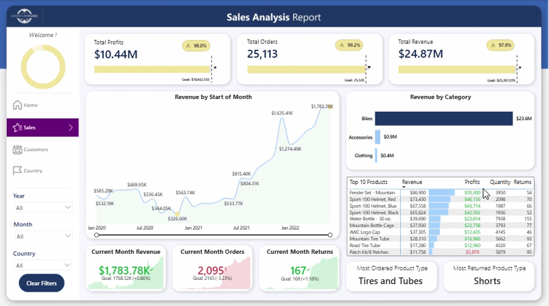
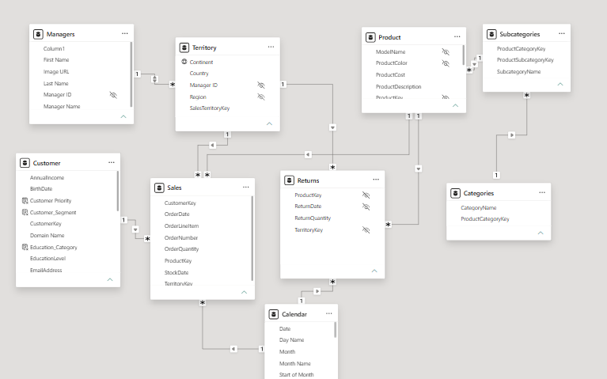
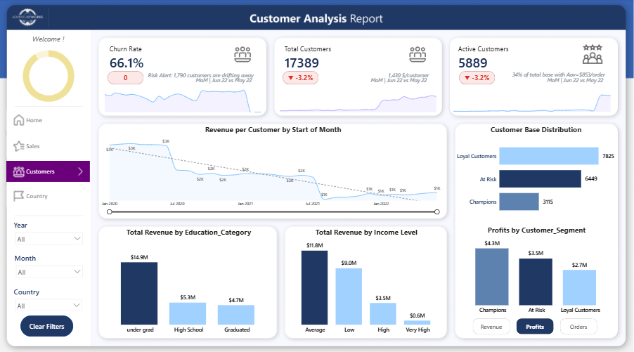

# 📊 Adventure Works: Executive Business Intelligence & Sales Analytics

---

## 📌 Executive Summary
This project delivers an interactive, end-to-end **Power BI Business Intelligence solution** designed for **Adventure Works**, a global manufacturing company. The report transforms fragmented sales, product, customer, and regional operational data into strategic business insights.

The dashboard empowers executive stakeholders to track revenue growth, evaluate customer lifetime value (RFM segmentation), analyze product profitability, and simulate pricing strategies using advanced dynamic modeling.

👉 **[Click Here to Access the Live Interactive Report](https://app.powerbi.com/reportEmbed?reportId=8728cb16-fd52-4bd0-a788-3608798d5434&autoAuth=true&ctid=79454428-4dbe-401a-b2ab-64a5a7069e2b)** *

---

## 📸 Interactive Dashboard Preview

> *Demonstrating dynamic report navigation, RLS security view testing, and What-If price elasticity simulations:*

---

## 💡 Key Business Questions Answered
* **Sales Performance:** Which product categories drive the highest net revenue and profit margins?
* **Product Optimization:** How do price changes directly impact forecasted profit margins across product lines?
* **Customer Segmentation:** Who are our most valuable customers (Champions vs. At-Risk), and what is our active customer retention rate?
* **Regional Dynamics:** Which countries demonstrate high return rates or margin compression?

---

## 🛠️ Architecture & Technical Features

### 1. Data Modeling & ETL (Power Query)
* **Star Schema Architecture:** Designed a clean multi-fact, multi-dimension schema to optimize DAX query performance and relationships.

* **ETL Transformations:** Handled missing values, standardized text fields, and created custom date tables to enable Time Intelligence analytics.

### 2. Advanced DAX & Analytical Mechanics
* **Dynamic Field Parameters:** Allowed users to toggle entire report canvases between `Revenue`, `Profits`, and `Orders` on the fly.
* **Targeted Drillthrough Pages:** Created a dedicated Product Analysis drillthrough canvas, allowing users to right-click any product from the main Sales page to instantly inspect its specific margins, price elasticity, and targets.
* **Time Intelligence Analytics:** Built metrics for YTD, Trailing 90-Day Active Customers, MoM Revenue growth, and Target vs. Actual variance tracking.
* **Calculation Groups for Scalable Time Intelligence:** 
  Utilized  Calculation Groups to dynamically apply Time Intelligence metrics (YTD, MoM, Prior Year Comparison) across multiple base measures, drastically reducing DAX redundancy, optimizing memory footprint, and ensuring clean model scalability.
* **Automated Peak/Highest Performance Highlighting:** 
  Engineered dynamic DAX conditional formatting measures across report visuals to automatically highlight peak-performing data points (e.g., top-performing month, category, or product) with distinct visual accents, instantly drawing executive attention to key positive outliers.
* **Dynamic Contextual KPI Cards (DAX String Manipulation):** 
  Leveraged advanced DAX Text Functions (`FORMAT`, string concatenation, and dynamic dates) to generate contextual multi-layered KPI sub-titles. These dynamically display key metadata—such as average revenue per customer, comparative MoM date frames (e.g., *Jun 22 vs May 22*), and risk alert summaries—directly inside the visual cards without overloading the canvas.

### 3. Customer Intelligence & RFM Segmentation
This page shifts the focus from macro-sales to customer lifecycle, retention, and behavioral analytics.

* **Context-Aware KPI Architecture:** Built highly advanced KPI cards featuring underlying trendlines and dynamic DAX string manipulation. 
  * Leveraging **Calculation Groups** (`SELECTEDMEASURE()`), the cards automatically compute Month-over-Month (MoM) variances alongside dynamic text labels (e.g., *MoM | Jun 22 vs May 22*).
  * **Churn Rate:** Features a dynamic Risk Alert DAX measure evaluating Recency (`R_Value`). If customers cross the 60-90 day inactivity threshold, the card automatically flags the exact number of users "drifting away".
  * **Customer Value Metrics:** Automatically calculates and displays contextual metadata such as Average Revenue Per User (ARPU / $/Customer) and Average Order Value (AOV) directly within the KPI frames.
* **RFM Customer Segmentation:** Implemented a robust Recency, Frequency, Monetary (RFM) model in DAX to classify the customer base into actionable cohorts (*Champions, Loyal Customers, At Risk*).
* **Demographic ROI:** Visualizes revenue distribution across customer income levels and education categories, paired with a trendline tracking the overall Revenue per Customer over time.

---

## 📊 Dashboard Page Breakdown

### 1. Sales Analysis Overview (Macro Performance)
Designed to give executives an immediate, data-driven snapshot of business health:

* **Executive KPI Cards (Actual vs Target):** Dynamic top-level KPIs tracking Revenue, Profits, and Orders against pre-defined targets, recalculating seamlessly based on user slicer selections.
* **Trend Analysis with Dynamic Markers:** Line chart highlighting revenue trajectory over time with smart automated markers identifying peak and lowest-performing months.
* **Month-over-Month (MoM) Performance Cards:** Current-month metrics (Revenue, Orders, Returns) featuring dynamic DAX conditional formatting (Green = Growth / Red = Decline) compared to prior month benchmarks.
* **Product & Category Breakdown:** Category-level profit comparisons and a Top 10 Products table displaying granular Revenue, Profit, Quantity, and Return volume metrics.

### 2. Product Performance & What-If Analysis
Focuses on individual SKU performance, return rates, and scenario testing via dynamic price sliders.

### 3. Customer Intelligence & RFM Segmentation
Tracks customer acquisition metrics, churn risk, income brackets, and customer lifecycle segments.

---

## 🚀 How to Run / Explore This Project
1. **Interactive Web Link:** Access the published live report directly via the link above.
2. **Static PDF Report:** Check `reports/` folder for a quick PDF export of all report pages.
3. **Power BI Desktop File:** Download the `.pbix` file located in `reports/` to inspect the underlying Star Schema model and DAX measures.

---

## ✍️ Author
* **Role:** Data Analyst / BI Specialist
* **LinkedIn:** [Your LinkedIn Profile URL]
* **Portfolio GitHub:** [Your GitHub Profile Link]
