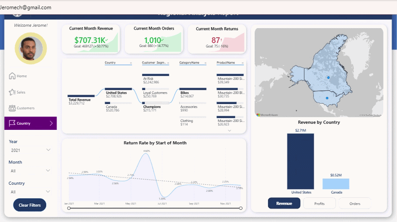
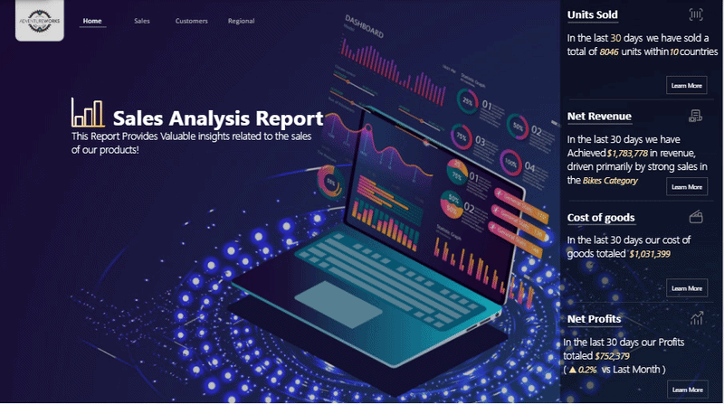
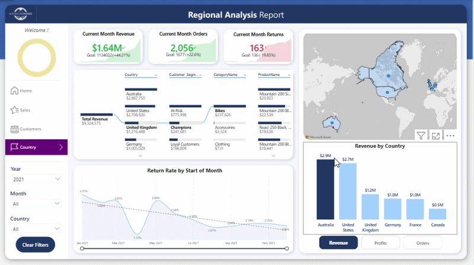

# 📊 Adventure Works: Executive Business Intelligence & Sales Analytics

---

## 📌 Executive Summary
An executive-focused Power BI Business Intelligence solution built to analyze sales performance, profitability, customer behavior, and regional operations for Adventure Works.

The project transforms transactional sales data into an interactive reporting solution that helps business stakeholders monitor KPIs, identify performance drivers, understand customer segments, and evaluate pricing scenarios.

---

## 📸 Dashboard Preview

> *Demonstrating dynamic report navigation, RLS security view testing, Field Parameters and What-If price elasticity simulations:*

---

## 💡 Strategic Business Questions Answered

Instead of basic descriptive analytics, this dashboard is engineered to answer complex, diagnostic, and predictive business queries for executive stakeholders:

**1. Customer Retention & Lifetime Value (RFM):**
* How is our customer base distributed across loyalty cohorts (Champions vs. Loyal vs. At-Risk), and what is the exact financial impact (ARPU) of our current churn rate?
* Which demographic segments (Income Level & Education) are generating the highest average order value (AOV)?

**2. Price Elasticity & Profitability (What-If Analysis):**
* How do hypothetical price adjustments on specific top-tier SKUs impact our overall forecasted profit margins and net revenue?
* Which specific products are driving our net profits, and how do their return rates affect the bottom line?

**3. Regional Root-Cause Analysis:**
* What are the precise micro-drivers (down to the product category and customer segment level) fueling revenue growth or decline in specific geographic regions?
* Are localized return rates remaining within acceptable thresholds, or are there regional quality-control anomalies?

**4. Executive Performance Tracking:**
* Are our current 30-day trailing metrics for net revenue and order volume outpacing historical Month-over-Month (MoM) benchmarks?
* What specific categories are the primary catalysts behind our short-term revenue spikes or dips?

---

## 🛠️ Architecture & Technical Features

### 1. Data Modeling & ETL (Power Query)
* **Star Schema Architecture:** Designed a clean multi-fact, multi-dimension schema to optimize DAX query performance and relationships.

* **ETL Transformations:** Handled missing values, standardized text fields, and created custom date tables to enable Time Intelligence analytics.

### 2. Advanced DAX & Analytical Mechanics
* **Dynamic Field Parameters:** Allowed users to toggle entire report canvases between `Revenue`, `Profits`, and `Orders` on the fly.
* **Targeted Drillthrough Pages:** Created a dedicated Product Analysis drillthrough canvas, allowing users to right-click any product from the main Sales page to instantly inspect its specific margins, price elasticity, and targets.
* **Time Intelligence Analytics:** Built metrics for YTD, Trailing 90-Day Active Customers, MoM Revenue growth, and Target vs. Actual variance tracking.
* **Calculation Groups for Scalable Time Intelligence:** 
  Utilized  Calculation Groups to dynamically apply Time Intelligence metrics (YTD, MoM, Prior Year Comparison) across multiple base measures, drastically reducing DAX redundancy, optimizing memory footprint, and ensuring clean model scalability.
* **Automated Peak/Highest Performance Highlighting:** 
  Engineered dynamic DAX conditional formatting measures across report visuals to automatically highlight peak-performing data points (e.g., top-performing month, category, or product) with distinct visual accents, instantly drawing executive attention to key positive outliers.
* **Dynamic Contextual KPI Cards (DAX String Manipulation):** 
  Leveraged advanced DAX Text Functions (`FORMAT`, string concatenation, and dynamic dates) to generate contextual multi-layered KPI sub-titles. These dynamically display key metadata—such as average revenue per customer, comparative MoM date frames (e.g., *Jun 22 vs May 22*), and risk alert summaries—directly inside the visual cards without overloading the canvas.

### 3. Data Governance & Security
* **Dynamic Role-Level Security (RLS):** Implemented dynamic user security rules based on `@USERPRINCIPALNAME()` to restrict regional managers to their assigned territories.

---

## 📊 Dashboard Page Breakdown
### 1. Executive Summary & Dynamic Narratives
Designed as the primary landing page, this section offers a high-level, 30-day trailing snapshot of core business health, heavily focusing on an intuitive, web-app-like user experience.

* **Dynamic Smart Narratives:** Instead of displaying static numbers, the KPIs utilize advanced DAX string manipulation to generate human-readable, actionable context. For example, the text dynamically updates to identify the exact category driving the current month's revenue (e.g., *driven primarily by strong sales in the Bikes Category*).
* **Trailing 30-Day Conditional Metrics:** Evaluates short-term performance (Units Sold, Net Revenue, Cost of Goods, Net Profits) using automated conditional formatting to instantly flag over-performing or under-performing metrics against prior periods.
* **App-Like Navigation (Action Buttons):** Engineered a seamless UI experience using Power BI Page Navigation/Bookmarks. Each high-level metric features a "Learn More" interactive button.
* **Metric Deep-Dive Canvases:** Clicking "Learn More" routes stakeholders to dedicated breakdown pages (e.g., Revenue Details). These micro-pages isolate the exact parameters driving the parent metric, unpacking performance across Top Products, Leading Countries, Customer Segments (RFM), and Categories.

**Executive Landing Page in Action:**

### 2. Sales Analysis Overview (Macro Performance)
Designed to give executives an immediate, data-driven snapshot of business health:

* **Executive KPI Cards (Actual vs Target):** Dynamic top-level KPIs tracking Revenue, Profits, and Orders against pre-defined targets, recalculating seamlessly based on user slicer selections.
* **Trend Analysis with Dynamic Markers:** Line chart highlighting revenue trajectory over time with smart automated markers identifying peak and lowest-performing months.
* **Month-over-Month (MoM) Performance Cards:** Current-month metrics (Revenue, Orders, Returns) featuring dynamic DAX conditional formatting (Green = Growth / Red = Decline) compared to prior month benchmarks.
* **Product & Category Breakdown:** Category-level profit comparisons and a Top 10 Products table displaying granular Revenue, Profit, Quantity, and Return volume metrics.

### 3. Customer Intelligence & RFM Segmentation
This page shifts the focus from macro-sales to customer lifecycle, retention, and behavioral analytics.

* **Context-Aware KPI Architecture:** Built highly advanced KPI cards featuring underlying trendlines and dynamic DAX string manipulation. 
  * Leveraging **Calculation Groups** (`SELECTEDMEASURE()`), the cards automatically compute Month-over-Month (MoM) variances alongside dynamic text labels (e.g., *MoM | Jun 22 vs May 22*).
  * **Churn Rate:** Features a dynamic Risk Alert DAX measure evaluating Recency (`R_Value`). If customers cross the 60-90 day inactivity threshold, the card automatically flags the exact number of users "drifting away".
  * **Customer Value Metrics:** Automatically calculates and displays contextual metadata such as Average Revenue Per User (ARPU / $/Customer) and Average Order Value (AOV) directly within the KPI frames.
* **RFM Customer Segmentation:** Implemented a robust Recency, Frequency, Monetary (RFM) model in DAX to classify the customer base into actionable cohorts (*Champions, Loyal Customers, At Risk*).
* **Demographic ROI:** Visualizes revenue distribution across customer income levels and education categories, paired with a trendline tracking the overall Revenue per Customer over time.

---
### 4. Regional & Operational Analysis
This page provides a geospatial breakdown of performance, focusing on localized current-month health and root-cause analysis for country-specific metrics.

* **Current-Month Conditional KPIs:** The top canvas highlights current-month Revenue, Orders, and Returns against dynamic targets. Built-in conditional formatting instantly communicates if a region is over-performing (Green) or under-performing (Red).
* **Root-Cause Decomposition Tree:** Utilized a Decomposition Tree visual to dynamically drill down into the driving parameters of Total Revenue. This allows stakeholders to organically unpack the data path from *Country ➔ Customer Segment ➔ Category ➔ Product*, instantly identifying the specific customer base and products dominating any given region.
* **Geospatial Mapping & Dynamic Metrics:** Integrated an Azure Map for geographic distribution, paired with a dynamic bar chart that toggles between Revenue, Profits, and Orders by country.
* **Custom Report Page Tooltips (Hidden Insights):** Engineered a custom tooltip page. When users hover over any country on the bar chart, it reveals a granular, hidden canvas displaying the historical Sales Trend (Revenue, Profits, Orders) for that specific region without cluttering the main UI.
* **Return Rate Monitoring:** A dedicated trendline tracks the Return Rate over time, enabling regional managers to spot quality control issues or market-specific anomalies quickly.

**Regional Analysis Overview:**

## 🚀 How to Run / Explore This Project
1. **Interactive Web Link:** Access the published live report directly via the link above.
2. **Static PDF Report:** Check `reports/` folder for a quick PDF export of all report pages.

---

## ✍️ Author
* **Name:** Ebram Wagdy
* **Role:** Data Analyst / BI Developer
* **LinkedIn:** [https://www.linkedin.com/in/ebram-wagdy/]
* **Portfolio GitHub:** [https://github.com/Ebram22]
